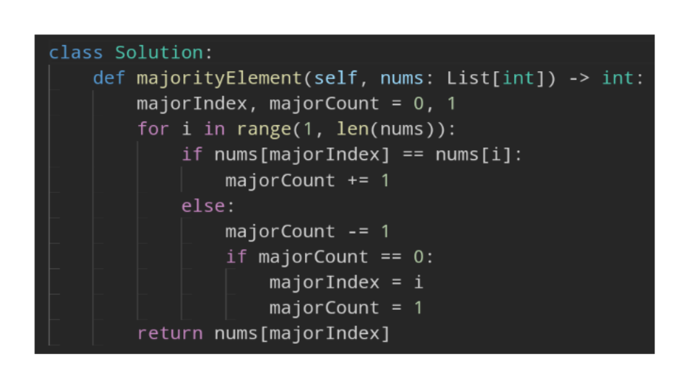

- #Boyer-Moore_majority_vote_algorithm #Array
- Goal
	- find and return the element that occurs in more than half of the array
- Thinking behind the Algorithm
	- This problem is basically made for the #Boyer-Moore_majority_vote_algorithm which is matches the specifications perfectly. Essentially we want to have a Candidate (majorIndex) and a Count (majorCount). Whenever we encounter our candidate we increment our count and whenever we see any other number we decrement count. Once count is zero set the candidate to the current index and reset count to 1
- Implementation
	- Python
		- ````def majorityElement(self, nums: List[int]) -> int:
		          majorIndex, majorCount = 0, 1
		          for i in range(1, len(nums)):
		              if nums[majorIndex] == nums[i]:
		                  majorCount += 1
		              else:
		                  majorCount -= 1
		                  if majorCount == 0:
		                      majorIndex = i
		                      majorCount = 1
		          return nums[majorIndex]
		  ````
	- 
- Image to remember
	- 
	-