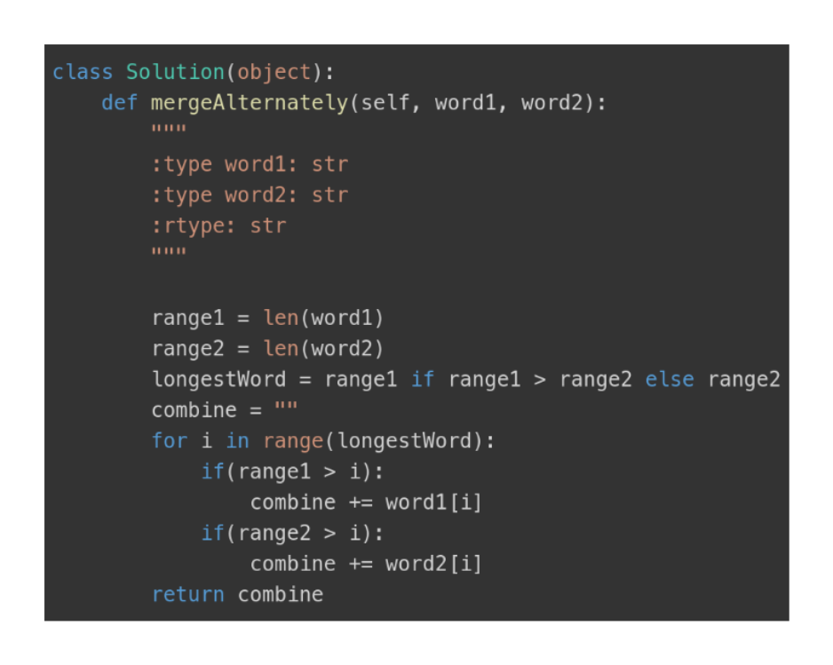

- Goal
	- We want to return an combined string from two strings where every other char is from one string and every other is from the other string
- Thinking Behind the Algorithm
	- Very simple algorithm first determining the longer of the two strings creating a for loop the traverses the indices based on this. Adding the char from one string if the indexer isn't beyond that strings length then doing the same for the other string.
- Implementation
	- 
- Image to remember
	- 
	-