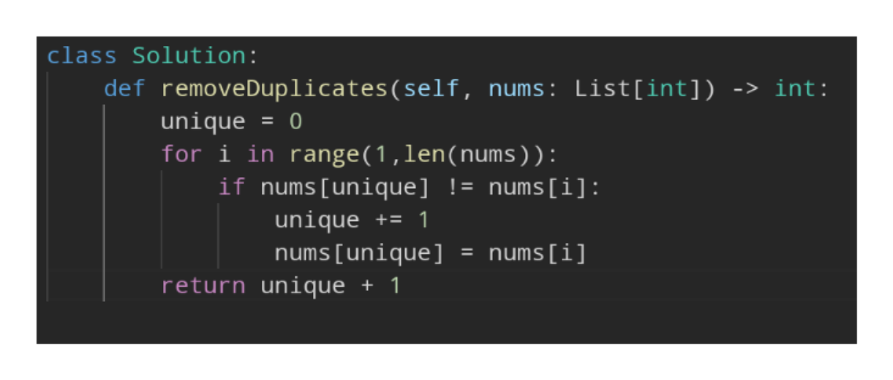

- #in-place #two_pointer
- Goal
	- We want to modify (in-place) a sorted array removing all duplicate elements
- Thinking behind the Algorithm
	- This problem is very similar to #[[27. Remove Element]] as we want to keep an index of the unique elements to keep track of the part of the array that contains only unique elements while i traverses the entire array. The difference comes in what value we check against. Rather than checking one value we want to check the last value added to the unique section of the array and if it doesn't match our current i we can add it to the unique section
- Implementation
	- 
- Image to Remember
	-